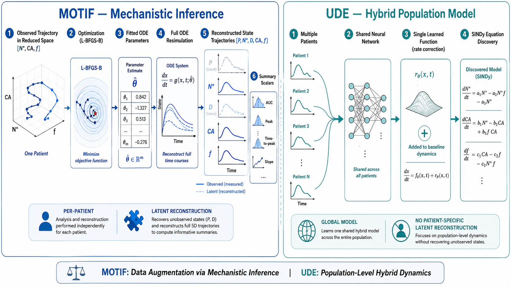
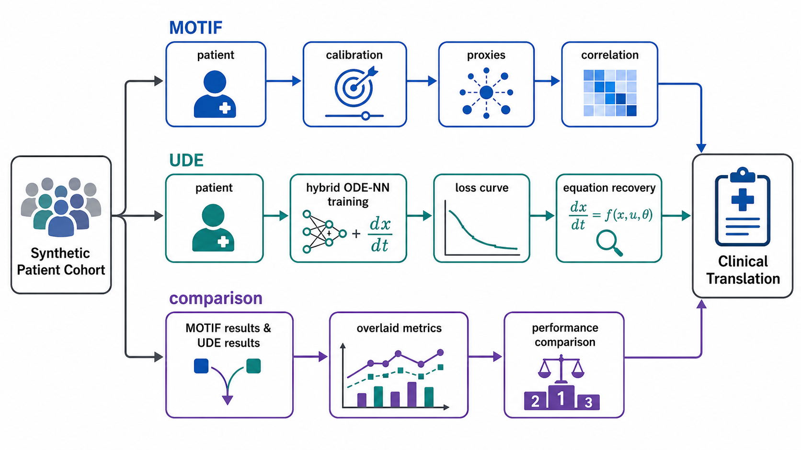

# ODE–Multiomics Benchmark: MOTIF vs. UDE Pilot

## Project Overview

This repository implements a synthetic-data benchmark comparing two complementary
approaches to integrating mechanistic ODE models with multiomics data:

1. **MOTIF-style proxy expansion** (Funk/Bangs/Paterson approach): Run a known ODE
   forward, use synthetic state-variable trajectories as proxy columns in a multiomics
   matrix, and recover biological signal through correlation analysis.

2. **UDE + SINDy structure learning** (Chang/Rackauckas approach): Use a partial
   observation model to feed observed "multiomics" into a Universal Differential
   Equation, learn unknown rate functions with a neural network, and recover
   interpretable equations via Sparse Identification of Nonlinear Dynamics (SINDy).

The benchmark model is Reynolds et al. (2006) — a 6-ODE system of acute inflammation
with known bistability and three clinically distinct outcome trajectories (resolution,
chronic inflammation, death). Ground-truth parameters are known, making precise
recovery evaluation possible.



---

## Scientific Context

### The Reynolds (2006) Model

Reynolds A, Rubin J, Clermont G, Day J, Vodovotz Y, Ermentrout GB.
"A reduced mathematical model of the acute inflammatory response: I. Derivation of
model and analysis of anti-inflammation."
*J Theor Biol* 242(1):220–36. (2006)

Six ODEs representing:
- `P`  — pathogen burden
- `N*` — early pro-inflammatory mediator (activated neutrophils / early cytokines; analog: IL-6, TNF-α)
- `D`  — late/damage-associated pro-inflammatory mediator (DAMPs, tissue signals)
- `CA` — anti-inflammatory mediator (analog: IL-10, TGF-β)
- `f`  — tissue damage fraction
- `h`  — tissue health/integrity (1 − f)

**Observation model for this benchmark:** Only `N*`, `CA`, and `f` are "observed"
(the multiomics). `P`, `D`, and `h` are latent — the biology to be recovered.

### Why This Model?

| Property | Relevance |
|---|---|
| Published canonical parameters | Ground truth for quantitative recovery evaluation |
| Bistability (3 attractors) | Non-trivial recovery problem; tests both methods under realistic complexity |
| Small state space (6 vars) | Both pipelines are tractable on a laptop |
| Infection-adjacent biology | Directly relevant to Stewart Chang's TB/inflammation background |
| Plasma proteomics analog | N* ≈ IL-6; CA ≈ IL-10; f ≈ organ failure score — realistic clinical mapping |

### Methodological Lineage

```
Hoffmann 2002 (Science)
  → Known ODE → experimental validation → predicts gene expression
  → "Forward model: biology → ODE → data"

Funk / Bangs / Paterson 2025-26 (MOTIF)
  → Known ODE → synthetic state variable trajectories → multiomics proxy columns
  → "Forward model + expansion: ODE generates interpretable proxies for multiomics"

Chang (this proposal / UDE approach)
  → Multiomics → encoder → UDE (known + learned terms) → SINDy → interpretable ODE
  → "Inverse problem: data trains the ODE structure via hybrid learning"
```

The benchmark directly compares methods 2 and 3 on shared synthetic data with
known ground truth from method 1.



---

## Repository Structure

```
ode-multiomics-benchmark/
│
├── README.md                          ← This file
├── CLAUDE_CODE_PROMPT.md              ← Full kickoff prompt for Claude Code
├── TECHNICAL_SPEC.md                  ← Full mathematical and implementation spec
├── EXPERIMENT_DESIGN.md               ← Experimental design, evaluation metrics, figures
│
├── papers/                            ← Reference PDFs
│   ├── Bangs 2025 - Developing a digital twin clinical decision support tool.pdf
│   ├── Brunton 2016 - Discovering governing equations from data by sparse identification of nonlinear dynamical systems.pdf
│   ├── Funk 2026 - Mining the gaps Deciphering Alzheimer's biology through AI-driven reconciliation.pdf
│   ├── Hoffmann 2002 - The IkB-NF-kB signaling module Temporal control and selective gene activation.pdf
│   ├── Paterson 2025 - From digital twins to multiomic inference A systems-level framework.pdf
│   ├── Rackauckas 2021 - Universal differential equations for scientific machine learning.pdf
│   ├── Reynolds 2006 - A reduced mathematical model of the acute inflammatory response.pdf
│   └── README_papers.md               ← Citation details and usage notes
│
├── src/
│   ├── __init__.py
│   ├── reynolds_ode.py                ← Reynolds 2006 ODE system + parameters
│   ├── synthetic_data.py              ← Virtual patient generator
│   ├── motif_pipeline.py              ← MOTIF proxy expansion pipeline
│   ├── ude_pipeline.py                ← UDE + SINDy pipeline
│   ├── evaluation.py                  ← Recovery metrics and statistical comparison
│   └── plotting.py                    ← All figure generation
│
├── notebooks/
│   ├── 01_reynolds_ode_exploration.ipynb
│   ├── 02_synthetic_patient_generation.ipynb
│   ├── 03_motif_pipeline.ipynb
│   ├── 04_ude_sindy_pipeline.ipynb
│   └── 05_comparison_and_figures.ipynb
│
├── experiments/
│   ├── config_baseline.yaml           ← Default experiment configuration
│   ├── config_sparse_data.yaml        ← Low-N patient experiment
│   ├── config_misspecified_ode.yaml   ← ODE misspecification experiment
│   └── config_noise_sweep.yaml        ← Noise level sweep
│
├── results/
│   └── .gitkeep
│
├── figures/
│   └── .gitkeep
│
├── tests/
│   ├── test_reynolds_ode.py
│   ├── test_synthetic_data.py
│   ├── test_motif_pipeline.py
│   └── test_ude_pipeline.py
│
├── environment.yml                    ← Conda environment specification
├── requirements.txt                   ← pip requirements
└── pyproject.toml                     ← Package configuration
```

---

## Papers Reference

All papers are present in `papers/`. For full citation details, DOIs, and usage notes,
see `papers/README_papers.md`. These are the primary references needed to understand
model equations and methodological context.

| Paper | Type | Year |
|---|---|---|
| Reynolds 2006 | Journal article | 2006 |
| Hoffmann 2002 | Journal article | 2002 |
| Brunton 2016 | Journal article | 2016 |
| Rackauckas 2021 | ArXiv preprint | 2021 |
| Funk 2026 | Journal article | 2026 |
| Bangs 2025 | Conference poster (AAIC) | 2025 |
| Paterson 2025 | Conference poster (AAIC) | 2025 |

---

## Quickstart

**If starting fresh (clone from GitHub):**

```bash
# 1. Clone repository
git clone https://github.com/Model-Stewardship/ode-multiomics-benchmark.git
cd ode-multiomics-benchmark

# 2. Create virtual environment and install dependencies
uv sync --extra dev

# 3. Run baseline experiment
uv run python -m src.run_experiment --config experiments/config_baseline.yaml

# 4. Launch notebooks
uv run jupyter lab notebooks/
```

**If you already have the directory locally:**

```bash
# Just create the virtual environment and install dependencies
uv sync --extra dev

# Then run experiments or notebooks as above
uv run python -m src.run_experiment --config experiments/config_baseline.yaml
uv run jupyter lab notebooks/
```

## Running Experiments

The baseline experiment runs with progress bars showing:
- Overall replicate progress (e.g., "Replicate 1/5")
- Individual step progress: synthetic patient generation, MOTIF calibration, UDE training
- Training loss updates every 10 epochs

```bash
# Run with progress output (default)
uv run python -m src.run_experiment --config experiments/config_baseline.yaml

# Suppress progress output (quiet mode)
uv run python -m src.run_experiment --config experiments/config_baseline.yaml --quiet
```

**Experiment Duration:** With default config (100 patients, 5 replicates, 500 UDE epochs):
- Synthetic patient generation: ~2-5 sec per replicate
- MOTIF calibration: ~30-60 sec per patient (bottleneck)
- UDE training: ~5-15 min per replicate (most time-consuming)
- **Total:** ~25 hours on local CPU, ~12 hours on Colab T4 GPU

**Note:** The 100×5 configuration is designed for teaching and rapid validation. For publication-quality studies, consider scaling to 200+ patients with 5 replicates (estimated 1-2 days locally), or use cloud infrastructure for parallel runs.

Results are saved to `results/` with timestamp-based subdirectories. Each replicate saves:
- `cohort.pkl` — synthetic patient data
- `motif_results.pkl` — MOTIF pipeline outputs
- `ude_results.pkl` — UDE + SINDy outputs
- `metrics.json` — aggregated recovery and classification metrics

### Scaling Experiments

For larger studies, use the intermediate configs:
- `config_baseline_colab_200x3.yaml` — 200 patients, 3 replicates (~18 hours locally)
- `config_baseline_colab_200x5.yaml` — 200 patients, 5 replicates (~30 hours locally)

For rapid prototyping on Colab:
- `config_fast.yaml` — 50 patients, 2 replicates, 50 UDE epochs (~10 minutes)

Example:
```bash
uv run python -m src.run_experiment --config experiments/config_baseline_colab_200x5.yaml
```

## Cleaning Up Between Runs

**If you abort a run:** No cleanup needed. Incomplete output directories are safe to leave (each run creates a new timestamped directory). You can delete old result directories if disk space is a concern:

```bash
# View generated results
ls results/

# Delete old results (optional)
rm -rf results/experiment-name_YYYYMMDD_HHMMSS/
```

**Cache files:** PyTorch may cache compiled code in `__pycache__/` directories. These are safe to delete:

```bash
# Clean Python cache (safe to do anytime)
find . -type d -name __pycache__ -exec rm -rf {} + 2>/dev/null
find . -type f -name "*.pyc" -delete
```

---

## Implementation Priority Order for Claude Code

1. `src/reynolds_ode.py` — ODE system (highest priority; everything else depends on it)
2. `src/synthetic_data.py` — virtual patient generator
3. `src/motif_pipeline.py` — MOTIF pipeline (faster to implement; validate first)
4. `src/evaluation.py` — recovery metrics
5. `src/ude_pipeline.py` — UDE + SINDy (most complex; implement last)
6. `src/plotting.py` — figures
7. All notebooks

---

## Key Design Decisions

- **Language:** Python 3.11+
- **ODE solver:** `scipy.integrate.solve_ivp` with RK45 for ground truth;
  `torchdiffeq` for the UDE (allows autograd through ODE solver)
- **SINDy:** `pysindy` library (Kaptanoglu et al. 2022)
- **UDE neural network:** PyTorch (MLP, 2 hidden layers, tanh activation)
- **Plotting:** matplotlib + seaborn; all figures publication-quality at 300 DPI
- **Configuration:** YAML via PyYAML; all experiment parameters externalised
- **Random seeds:** All stochastic components seeded; reproducibility required

---

## Contact / Project Origin

Developed by Stewart Chang (Model Stewardship LLC) as a methodological pilot
comparing MOTIF-style ODE proxy expansion (Funk/Bangs/Paterson 2025-26) with
UDE-based structure learning (Rackauckas 2021 + Chang TB concept note 2026)
on a canonical acute inflammation model.

Intended outputs:
- Preprint / methods paper comparing both pipelines
- LinkedIn post series demonstrating QSP + generative AI competency
- Open-source Python package for the broader QSP / systems biology community
